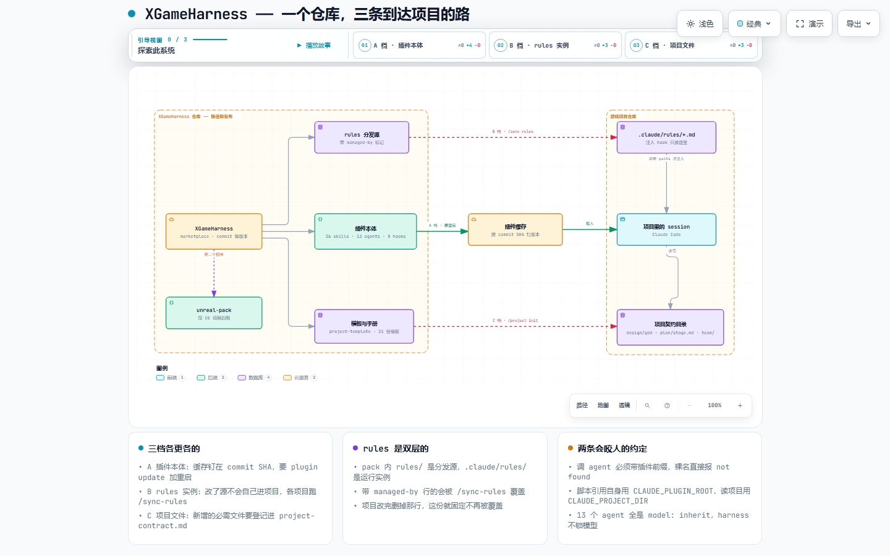

# XGameHarness — GameStudio 共享 Agent Harness

多项目共享的 Claude Code 插件市场(plugin marketplace，注册名同仓库名 XGameHarness)。
所有 GameStudio 项目从这里获取统一的 skills / agents / hooks / 流程规则。

> ⚠ **2026-09-18 起改成显式版本号。** 两个插件的 `plugin.json` 现在都写
> `"version"`，**改了 harness 就要 bump 它**，否则各项目静默停在缓存里那一份 ——
> Claude Code 按这个字符串判断要不要更新，字符串没动就跳过，而且不会有任何提示。
> 原来是不写 version（commit 即版本，推一次更新一次），换掉是为了让同一个仓库也能
> 当 Codex 的插件市场：那边的缓存路径就是版本号，没有它装不进去。取舍见
> [HANDBOOK § 7](plugins/game-studio-core/docs/HANDBOOK.md#7-codex-那一侧现在有什么)。

> **⚡ 主推入口：`/how-to-do <想做的事>`** —— 任何时间任何情况帮你澄清目标、检索
> 匹配 skill/agent、给出完整建议流程并立刻推进（无参数 = "我现在该干嘛"）。
>
> **📖 详细操作手册**：[`plugins/game-studio-core/docs/HANDBOOK.md`](plugins/game-studio-core/docs/HANDBOOK.md)
> —— 任务导向速查（「我想写策划案」→ 用哪个 skill/agent），含 hooks 说明、rules 双层
> 管理、加插件流程、故障排查。已接入项目内 `/handbook <关键词>` 直查。
>
> agent 侧执行 **R5 Skill-first 路由**（superpowers 式强制流程）：接到任务先扫
> skill 匹配，命中即调用；SessionStart hook 每 session 注入该规则。

## 插件

| 插件 | 内容 | 适用 |
|---|---|---|
| `game-studio-core` | 25 个自研流程 skills（/how-to-do、/start、/brainstorm、/explore-design、/design-system、/sprint-plan、/gate-check、/project-init、/harness-upgrade、/sync-rules、/handbook…）+ 1 个 vendored 第三方 skill（`archify` 画架构/流程/时序/数据流/状态机图，见下）+ 8 个设计 agents（producer、creative-director、technical-director、narrative-director、*-designer）+ 8 个 hooks（session-state 恢复 / 身份解析 / R2 语言注入 / rules 注入 / git 校验；另有 `resolve-identity.sh` 为共享库非 hook）+ 通用 rules 源 + 流程 docs、模板、操作手册、项目接入模板 | 所有游戏项目 |
| `unreal-pack` | 5 个 UE 专家 agents（unreal-specialist、ue-blueprint/gas/umg/replication-specialist）+ UE path-scoped rules 源（gameplay/ai/ui/test） | 仅 UE 项目 |

> **调用 agent 必须带插件前缀**：`subagent_type` 取 `game-studio-core:producer` /
> `unreal-pack:ue-gas-specialist` 这种全名，裸名会直接报 `Agent type not found`。
>
> **模型**：13 个 agent 全部 `model: inherit`，跟随主 session 当前模型，harness
> 不锁定 —— 硬编码模型对没有该模型权限的开发者是直接故障，而项目侧无法覆盖
> 插件 agent 的配置（同名文件只会新建一个裸名 agent）。**建议在 Opus 或 Fable
> 下调用 subagent**；单次覆盖可在 Agent 调用时传 `model` 参数。

> **vendored 第三方 skill**：`plugins/game-studio-core/skills/archify/` 是整包收录的上游
> release（[tt-a1i/archify](https://github.com/tt-a1i/archify) v2.16.0，MIT），把系统描述
> 或仓库代码变成单文件可交互架构图。**那 76 个文件与官方 `archify.zip` 逐字节一致，
> 不要直接改** —— `.gitattributes` 给该路径设了 `-text` 关掉行尾转换，保证随时能对
> SHA-256。来源、校验方法、升级步骤、它那个低频联网版本检查怎么关、品牌图标的许可
> 注意事项，见 [`plugins/game-studio-core/docs/vendored-archify.md`](plugins/game-studio-core/docs/vendored-archify.md)。

## 图

用 `archify` 画的，源在 [`docs/diagrams/`](docs/diagrams/)。每张都是**一个自包含的
可交互 HTML**：能搜节点、追上下游、按引导视图逐段看、切明暗主题、导出 PNG/SVG。
下面的 PNG 只是静态快照，**点标题打开 HTML 才是完整的**。

| 图 | 讲什么 |
|---|---|
| [**一个仓库，三条到达项目的路**](docs/diagrams/harness-overview.html) | marketplace → 两个插件 → A/B/C 三档各自怎么到项目，以及 rules 的双层结构 |
| [**一次 session 里 harness 在什么时候插话**](docs/diagrams/harness-session.html) | 8 个 hook 的三种时机、R5 Skill-first 路由、两道闸门分别拦什么 |
| [**两个仓库接在哪儿**](docs/diagrams/two-repos-contract.html) | harness 定结构、UI 照结构读，中间那四类文件就是唯一的接口 |

[](docs/diagrams/harness-overview.html)

改图不要动 HTML，改同名的 `.json` 再重新交付：

```powershell
cd plugins\game-studio-core\skills\archify
node bin\archify.mjs validate architecture ..\..\..\..\docs\diagrams\harness-overview.architecture.json --quality showcase --json
node bin\archify.mjs deliver  architecture ..\..\..\..\docs\diagrams\harness-overview.architecture.json ..\..\..\..\docs\diagrams\harness-overview.html --quality showcase --json
node bin\archify.mjs visual-check ..\..\..\..\docs\diagrams\harness-overview.html --json
```

三张都过了 showcase 档：9 项产物检查全通过、0 错 0 警，`visual-check` 在
1440×900 / 1600×1000 / 1920×1080 / 2048×1320 四档视口、明暗两套主题下都不溢出。

## 新项目接入

在新项目根目录跑一次 **`/project-init`**（自动复制模板 + 填项目名 + 同步 rules +
输出收尾清单）。手动等价步骤见 HANDBOOK § 3。

每台开发机一次性配置（私有仓库自动更新需要）：

```bash
gh auth setup-git
# 环境变量：CLAUDE_CODE_PLUGIN_KEEP_MARKETPLACE_ON_FAILURE=1
```

手动兜底：`/plugin marketplace update XGameHarness`。

## 已接入项目的升级

**harness 更新后，项目不会自己跟上。** 在项目里跑 **`/harness-upgrade`**，它按三档核对：

| 档 | 内容 | 更新方式 |
|---|---|---|
| A 插件本体 | skills / agents / hooks / docs / templates | `claude plugin marketplace update XGameHarness` → `claude plugin update <plugin>@XGameHarness` → **重启**。缓存按 commit SHA 钉版本，**不保证自动更新** |
| B rules 实例 | `.claude/rules/*.md` | `/sync-rules` |
| C 项目文件 | `plan/stage.md`、`CLAUDE.md`、`.claude/settings.json` … | `/harness-upgrade`，清单见 `game-studio-core/docs/project-contract.md` |

改 harness 时新增了任何项目侧必需文件，**同步在 `project-contract.md` 加一行** ——
否则老项目没有任何机制知道它的存在。

## 项目契约（hooks / skills 依赖的目录约定）

hooks 以项目根为 CWD 读以下约定路径，全部有存在性守卫（缺失 = 静默跳过）：

```
design/gdd/                      # GDD（design-docs rule / detect-gaps / pre-compact 读）
plan/                            # sprint / milestone
plan/stage.md                    # 阶段 SoT：frontmatter `current_stage` + sub-phase 矩阵。
                                 #   gate-check / project-stage-detect / start / how-to-do 均读它；
                                 #   由 /project-init 拷模板生成（无独立的 stage.txt）
team/session-state/{identity}/   # active.md 会话状态（session-start 恢复）
team/session-logs/{identity}/    # 月度轮转 session log（session-stop 写）
team/memo/{recipient}/           # 跨开发者 memo（/start surface）
docs/architecture/               # ADR
.claude/team.json                # 身份注册（resolve-identity 读）。由 /project-init 问询生成；
                                 #   harness 只提供 project-template/.claude/team.json.template
                                 #   仓库公开时建议 git_emails 留空数组，只靠 git_users 匹配
.claude/rules/*.md               # path-scoped rules 项目实例（注入 hook 只读这里）
.claude/harness-config.json      # 可选：{"excludedAgents": ["unreal-pack:ue-replication-specialist"]}
                                 #   抑制 suggest-subagent 提示；填带前缀的 agent 全名
.claude/state/                   # hook 运行时状态（项目模板已带 .gitignore 忽略此目录）
```

## rules 双层管理

pack 内 `rules/` 目录是**分发源**（frontmatter 带 `managed-by: XGameHarness/<pack>`），
项目 `.claude/rules/` 是**运行实例**。用 `/sync-rules` 同步；项目定制（最常见 = 按项目
目录改 `paths:`）后删掉 managed-by 行即固定不被覆盖。详见 HANDBOOK § 4。

## 修改 harness 的规范

- 直接在 `main` 提交(commit)；推送(push)后所有项目下个 session 生效
- **改了要让项目收到的东西，必须同时 bump 对应插件 `plugin.json` 的 `version`** ——
  忘了 bump 的表现是「推上去了，但谁都没变化」，而且**没有任何地方会报错**。
  只改 `plugin.json` 那一处，**别在 `marketplace.json` 里也写** ——
  两处都有时 Claude Code 静默取 `plugin.json` 那个，另一个会掩盖问题
- 改前 `claude plugin validate .`；坏改动回滚 = `git revert` + 各机
  `/plugin marketplace update XGameHarness`
- 插件内脚本引用自身文件用 `${CLAUDE_PLUGIN_ROOT}`，读项目文件用相对路径 /
  `CLAUDE_PROJECT_DIR`（勿用 `__file__` 推项目根——脚本运行在插件缓存里）
- **`.codex/hooks/` 镜像不自动同步**：项目里的 Codex CLI hook 副本独立存在，
  hooks 改动后需手动搬运。⚠ 括号里原来写的「Codex 无插件机制」**2026-09-18 起不成立**
  —— Codex 2026-03 上了插件市场，插件能带 skills / hooks / MCP。要手动搬的真实原因
  是**两边的清单格式不同**，不是那边没有机制。对照见
  [HANDBOOK § 7](plugins/game-studio-core/docs/HANDBOOK.md#7-codex-那一侧现在有什么)
- rules 源改动不会自动进入已接入项目——各项目跑 `/sync-rules` 拉取
- 加新插件流程见 HANDBOOK § 5

## 历史

从 RichLethe `.claude/`（上游 fork 自 [Donchitos/Claude-Code-Game-Studios](https://github.com/Donchitos/Claude-Code-Game-Studios)
模板 v0.3.0）于 2026-07-14 抽取泛化。RichLethe 为第一个消费方。项目专属内容
（rules 实例 / team.json / 项目 docs 三件套 / engine-reference）留在各项目仓库。
同日：仓库改名 claude-harness → XGameHarness（X = owner 代号，去 claude 以便
将来容纳其他 agent 运行时的插件）；rules / 项目模板 / 操作手册 pack 化。
