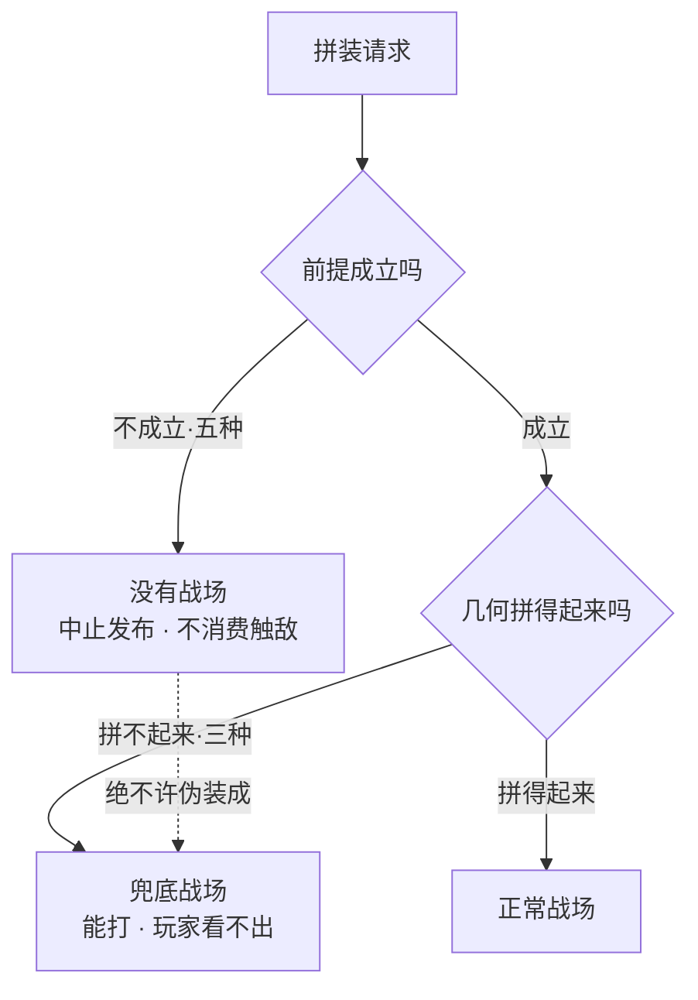
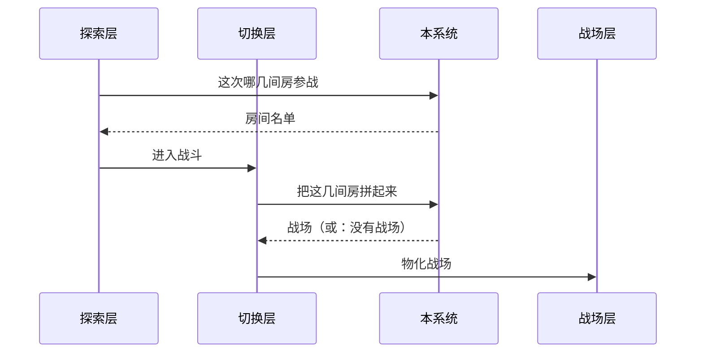
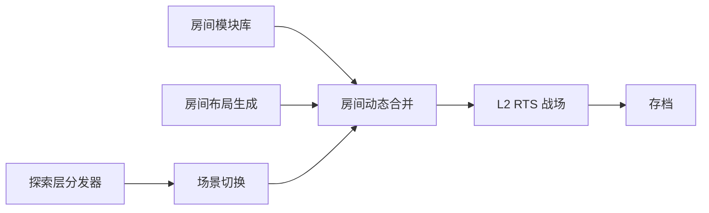

# 一个例子：同一段内容，画之前和画之后

拿真实的 #22 房间动态合并读本做对照。**左边是原来的文字，右边是画出来之后。**

在 GitHub 上看这一页，三张 mermaid 会渲染出来；例四的 ```svg 只有客户端画（GitHub 上是源码）。

---

## 例一：三种失败 vs 五种真错误

这是这个系统最要紧的一条，也是最容易被实现者搞错的一条。

### 画之前（读本 r4 版的原文）

> 三种拼接失败 —— 全部邻接被拒、图不连通、变换冲突 —— 都返回一张可玩的兜底战场，
> 并在结果里标明是哪一种失败。
>
> 另有五种情况是真错误：输入非法、内容缺失、重入、几何未就绪、契约不匹配。
> 真错误的结果是没有战场，上游必须中止发布、不消费触敌事件、不调用战场层。
>
> 这两类必须正交，绝不许互相伪装。把真错误包装成兜底战场交下去，
> 玩家会进入一场基于损坏状态的战斗，而没有任何地方会报错。

**问题**：读者要同时记住「三种 + 五种」「两条去向」「一条禁令」。
三段文字读完，脑子里未必拼得出那张分岔图。

### 画之后



**图替掉了三段里的两段。** 剩下要写的只有：哪三种、哪五种（一张表），
以及那条虚线为什么存在。

注意图里那条**虚线** —— 它标的正是那条禁令。
mermaid 的 `-.文字.->` 就是用来挂这种反直觉注解的。

---

## 例二：谁在什么时候调它

### 画之前

> 调用链固定为四步，本系统在其中出现两次：
>
> 1. 探索层的事件分发器检测到玩家触发了战斗
> 2. 分发器问本系统：这次哪几间房参战
> 3. 场景切换系统据此组装输入，调本系统拼战场
> 4. 拼出来了就交给战场层物化
>
> 第 2 步和第 3 步职责分明：第 2 步决定哪几间房，第 3 步决定这几间房怎么拼。

**问题**：「本系统出现两次」是这段话的重点，但编号列表把它藏起来了 ——
读者要自己数才发现第 2 步和第 3 步都指向同一个系统。

### 画之后



**「本系统出现两次」现在是图上一眼可见的事实** —— 那条竖线被指了两回。
分工那句话（选房 vs 拼装）还得留着，但不用再解释「出现两次」了。

---

## 例三：上下游

### 画之前

> 上游三者联合：场景切换系统触发、房间布局生成提供房间与邻接、房间模块库提供判据与模板。
> 下游只有一个消费者：L2 RTS 战场。三类可预期的拼接失败由本系统包装成合法的兜底战场，
> 不阻塞下游；真错误则明确不产生战场，下游不得被调用。

### 画之后



**本系统被描出来了**（`class D key` 那行）。没有这一笔，
读者看到七个方框，不知道这张图的主角是谁。
**不写 `style D fill:#…`** —— 写死的颜色在客户端深色档下看不清，客户端会拿掉它（见 `diagrams.md` 的绘图词表）。

图上还多出了一个文字里没明说的事实：**存档在下游的下游** ——
本系统的输出经战场层投影之后才进存档，它自己不存档。

---

## 例四：房间怎么摆（空间 —— 用 ```svg 图解）

### 画之前

> 锚房是触敌所在的那间，落在原点、朝向归零。其余参战房间按它们在探索地图上
> 相对锚房的位置和朝向摆放：东边那间保持原朝向，北边那间转了半圈。
> 门与门之间的相对关系不变。

**问题**：读者要在脑子里**摆出一个 L 形**。这不是关系是位置 ——
mermaid 只会把三间房排成一串方框，恰好把「L 形」这件事画没了。

### 画之后

```svg
<svg viewBox="0 0 440 290">
  <title>其余的房，按撞见敌人的那间来算位置</title>
  <line class="line" x1="40" y1="250" x2="420" y2="250"/>
  <line class="line" x1="40" y1="250" x2="40" y2="20"/>
  <rect class="box key" x="40" y="130" width="120" height="120"/>
  <rect class="box" x="160" y="130" width="120" height="120"/>
  <rect class="box" x="160" y="10" width="120" height="120"/>
  <line class="gap key" x1="160" y1="180" x2="160" y2="200"/>
  <line class="gap" x1="210" y1="130" x2="230" y2="130"/>
  <circle class="dot key" cx="40" cy="250" r="6"/>
  <text class="name key" x="100" y="195" text-anchor="middle">撞见敌人</text>
  <text class="label" x="220" y="195" text-anchor="middle">不转</text>
  <text class="label" x="220" y="75" text-anchor="middle">掉了个头</text>
  <text class="label key" x="40" y="276" text-anchor="middle">原点</text>
</svg>
```

**图替掉了整段。** 「落在原点」「东边那间」「北边那间转了半圈」—— 三句方位话，
读者一眼看完。**图里没写坐标** —— 那几个数在规则表里，这里只画「按它算」。

---

## 收口：什么时候别画

上面四例都过了判据（三样以上东西的关系，或者一个要在脑子里摆出来的形状）。下面这些不该画：

| 内容 | 为什么不画 |
|---|---|
| 「门中心重合容差是半格」 | 一句话说完，画出来是装饰 |
| 用 mermaid 画房间怎么摆 | **mermaid 画不了自由图形**，硬画比不画还难读。用 ```svg 图解（例四） |
| 旋钮清单、名词对照 | 是矩阵，用 GFM 表格 |
| 把已经很清楚的一段话再用方框重画一遍 | 图要**替掉**那段话。原文一个字没减，说明图没干活 |
