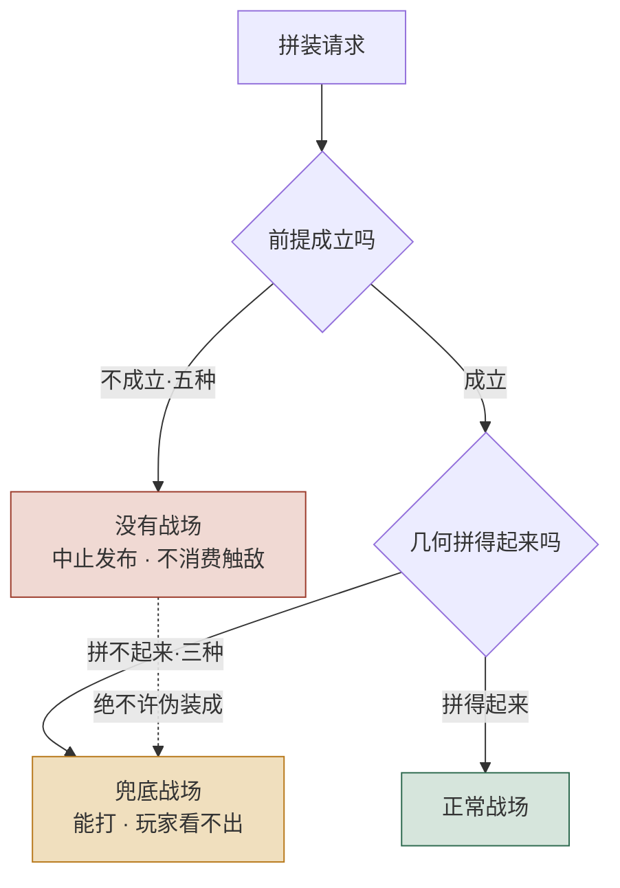
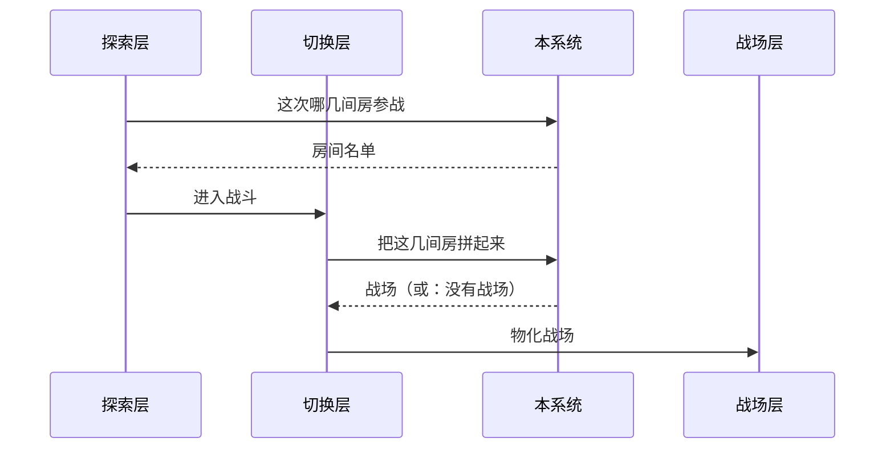
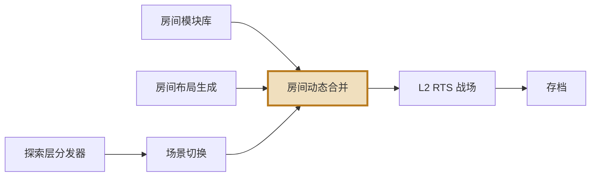

# 一个例子：同一段内容，画之前和画之后

拿真实的 #22 房间动态合并读本做对照。**左边是原来的文字，右边是画出来之后。**

在 GitHub 上看这一页，三张图都会渲染出来。

---

## 例一：三种失败 vs 五种真错误

这是这个系统最要紧的一条，也是最容易被实现者搞错的一条。

### 画之前（读本 r4 版的原文）

> 三种拼接失败 —— 全部邻接被拒、图不连通、变换冲突 —— 都返回一张可玩的兜底战场，
> 并在结果里标明是哪一种失败。
>
> 另有五种情况是真错误：输入非法、内容缺失、重入、几何未就绪、契约不匹配。
> 真错误的结果是没有战场，上游必须中止发布、不消费触敌事件、不调用战场层。
>
> 这两类必须正交，绝不许互相伪装。把真错误包装成兜底战场交下去，
> 玩家会进入一场基于损坏状态的战斗，而没有任何地方会报错。

**问题**：读者要同时记住「三种 + 五种」「两条去向」「一条禁令」。
三段文字读完，脑子里未必拼得出那张分岔图。

### 画之后

**图替掉了三段里的两段。** 剩下要写的只有：哪三种、哪五种（一张表），
以及那条虚线为什么存在。

注意图里那条**虚线** —— 它标的正是那条禁令。
mermaid 的 `-.文字.->` 就是用来挂这种反直觉注解的。

---

## 例二：谁在什么时候调它

### 画之前

> 调用链固定为四步，本系统在其中出现两次：
>
> 1. 探索层的事件分发器检测到玩家触发了战斗
> 2. 分发器问本系统：这次哪几间房参战
> 3. 场景切换系统据此组装输入，调本系统拼战场
> 4. 拼出来了就交给战场层物化
>
> 第 2 步和第 3 步职责分明：第 2 步决定哪几间房，第 3 步决定这几间房怎么拼。

**问题**：「本系统出现两次」是这段话的重点，但编号列表把它藏起来了 ——
读者要自己数才发现第 2 步和第 3 步都指向同一个系统。

### 画之后

**「本系统出现两次」现在是图上一眼可见的事实** —— 那条竖线被指了两回。
分工那句话（选房 vs 拼装）还得留着，但不用再解释「出现两次」了。

---

## 例三：上下游

### 画之前

> 上游三者联合：场景切换系统触发、房间布局生成提供房间与邻接、房间模块库提供判据与模板。
> 下游只有一个消费者：L2 RTS 战场。三类可预期的拼接失败由本系统包装成合法的兜底战场，
> 不阻塞下游；真错误则明确不产生战场，下游不得被调用。

### 画之后

**本系统被描出来了**（`style` 那行）。没有这一笔，
读者看到七个方框，不知道这张图的主角是谁。

图上还多出了一个文字里没明说的事实：**存档在下游的下游** ——
本系统的输出经战场层投影之后才进存档，它自己不存档。

---

## 收口：什么时候别画

上面三例都过了判据（三样以上东西的关系）。下面这些不该画：

| 内容 | 为什么不画 |
|---|---|
| 「门中心重合容差是半格」 | 一句话说完，画出来是装饰 |
| 房间怎么在战场上摆、L 形长什么样 | **mermaid 画不了自由图形**，硬画比不画还难读。这类做 HTML 图解页 |
| 旋钮清单、名词对照 | 是矩阵，用 GFM 表格 |
| 把已经很清楚的一段话再用方框重画一遍 | 图要**替掉**那段话。原文一个字没减，说明图没干活 |
