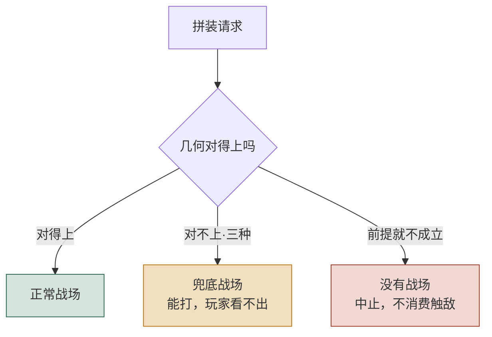
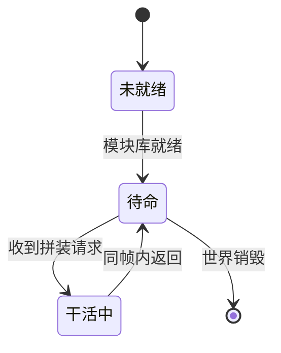
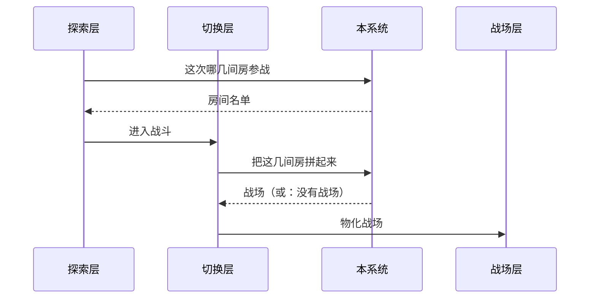
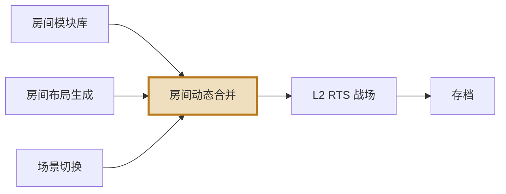
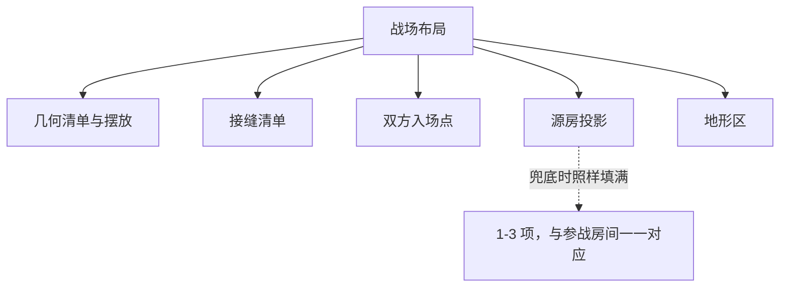

# 文档里的图

Harness 所有文档的画图约定 —— GDD、ADR、便条、sprint plan、阶段报告，一视同仁。
**默认记法是 mermaid。**

---

## 什么时候该画

**判据：一段话要读者在脑子里同时记住三样以上东西之间的关系时，画出来。**

| | 例 |
|---|---|
| ✅ 该画 | 「三种拼接失败都走兜底，而五种真错误根本不产生战场」—— 两组东西、两条去向 |
| ✅ 该画 | 「分发器问本系统选房 → 切换层组装 → 再调本系统拼装 → 交给战场层」—— 四方、两次往返 |
| ❌ 不该画 | 「容差是半格」—— 一句话说完的事 |
| ❌ 不该画 | 把一段已经很清楚的文字再用方框重画一遍 |

**图要替掉那段话，不是给那段话配插图。** 画完之后如果原文一个字都没减，
说明这张图没在干活。

---

## 记法

### 默认：mermaid

写在 ` ```mermaid ` 围栏里。GitHub、Notion、VS Code 预览、Claude 的 artifact
都直接渲染它；不渲染的地方退化成一段能读的文字，不会变成乱码。

> **客户端现状（2026-09-14）**：XGameHarnessUI 尚未装 mermaid，
> 围栏在客户端里会显示成代码块。**这是已知的、正在处理的缺口**，
> 不是不用 mermaid 的理由 —— 文档的寿命比这个缺口长。

### 什么时候不用 mermaid

- **矩阵、对照、参数表** → 用 GFM 表格。mermaid 画不了表，硬画只会更难读
- **空间布局**（房间怎么摆、界面长什么样、关卡形状）→ mermaid 画不了自由图形。
  值得画好的话做一个配套 HTML 图解页，文档里一行链接指过去
- **已经用 ASCII 画好且读得懂的旧图** → 别为了统一记法去重画。
  改到那一段时顺手换，没改到就留着

### 绝对不能用

**内联 `<svg>` 或任何原始 HTML。** 客户端故意不装 `rehype-raw`
（理由：agent 的输出属于不可信输入，装了它模型生成的 HTML 就会在桌面应用里执行）。
写了会被转义成一屏尖括号 —— 不报错，就是没法读。

---

## 五种骨架，照抄改词

### 一、分支：一件事有几种去向

最常用的一种。分类、失败模式、资格判定都是它。



**要点**：菱形是判断，方框是结果。用 `style` 给三类结果上不同的色，
读者扫一眼就知道哪条是好路。`<br/>` 换行，让方框里能写两行。

### 二、流转：有生命周期的东西

状态机、run 的阶段、招募流程。



**要点**：箭头上写**触发条件**，不是写动作名。`[*]` 是起止。

### 三、时序：谁先谁后、谁调谁

跨系统的调用链，尤其是有来回的。



**要点**：实线 `->>` 是调用，虚线 `-->>` 是返回。
本系统在链条里出现两次这种事，用时序图一眼就看出来，用文字要写三段。

### 四、依赖：谁依赖谁

上下游关系，一张图代替两张表。



**要点**：把**本篇讲的那个系统**用 `style` 描出来，
否则读者分不清这张图的主角是谁。

### 五、构成：一个东西由哪些部分组成

ADR 里的架构图、一份数据的字段构成。



**要点**：虚线箭头 `-.文字.->` 挂注解，用来标那些**反直觉**的地方。

---

## 三条硬规矩

**一、图里不许写数值。** 跟正文一个标准。
写「随关卡推进变少」，不写「× 0.6」。
同一个数在图和规则表各写一遍，改了其中一处不会有任何地方报错。

**二、中文节点名不要带英文标识符。** 写「房间模块库」不写 `URoomModuleSubsystem`。
真名留给「名词对照」那张表。ADR 是例外 —— 它本来就是讲实现的。

**三、一张图只说一件事。** 一张图里塞了判断、时序、依赖三种关系，
等于三张图叠在一起，读者一样得在脑子里拆开。拆成三张。

---

## 语法坑（都踩过）

| 症状 | 原因 | 怎么写 |
|---|---|---|
| 整张图不渲染 | 节点文字里有 `(` `)` `[` `]` `{` `}` | 用引号包起来：`A["含(括号)的文字"]` |
| 中文节点名报错 | 文字里有 `:` `;` | 同上，用引号包 |
| 箭头文字丢了 | `-->|文字|` 写成了 `--> |文字|` | 竖线**紧贴**箭头，不留空格 |
| 换行不生效 | 用了 `\n` | 用 `<br/>` |
| 方向不对 | `TD` / `LR` 写混 | `TD` 上到下（分支用），`LR` 左到右（依赖、流程用） |

---

## 各类文档画什么

| 文档 | 最该画的 |
|---|---|
| **GDD 读本** | 分支（失败去向）、时序（谁调谁） |
| **GDD 正文** | 流转（状态机）、依赖（上下游） |
| **ADR** | 构成（架构）、依赖。**ADR 允许出现真实类名与接口名** |
| **便条** | 通常不需要。一件事说不清才画，且只画一张 |
| **sprint plan** | 依赖（任务先后）。甘特图慎用 —— 它很快就过期 |
| **阶段报告** | 分支（判定结论怎么来的） |
