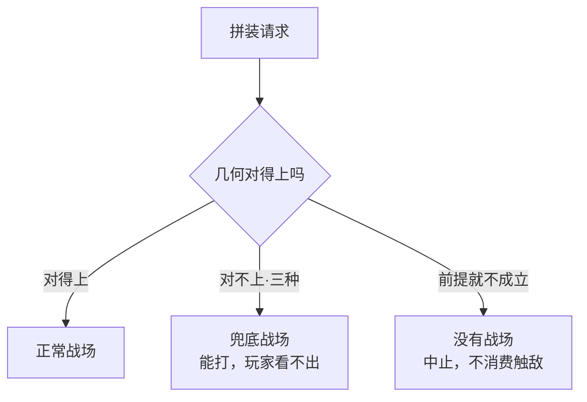
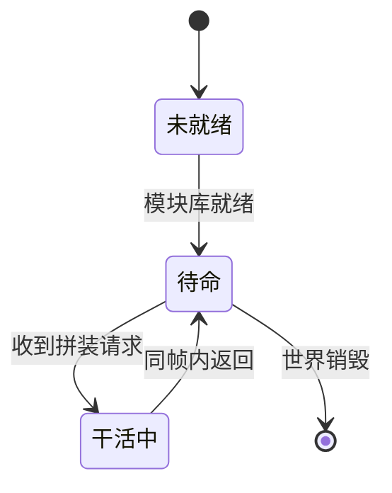
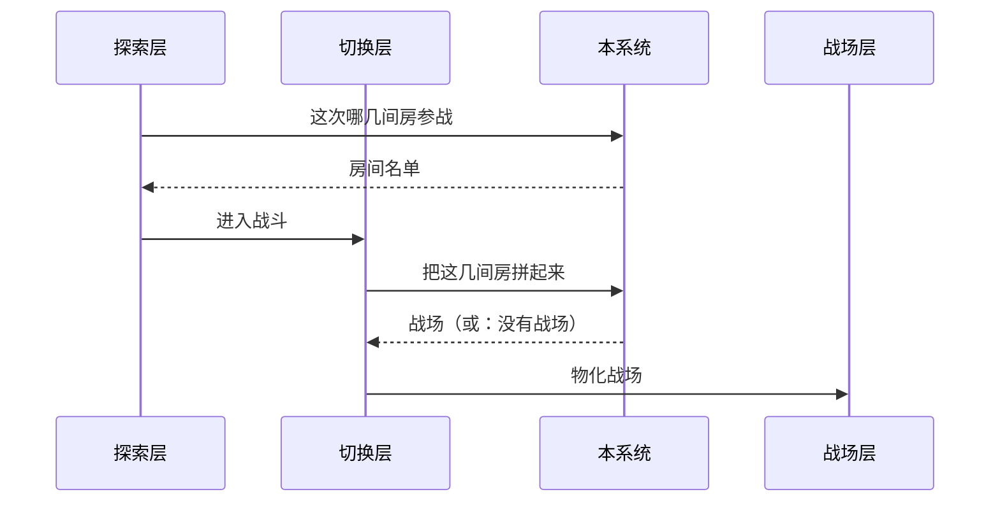
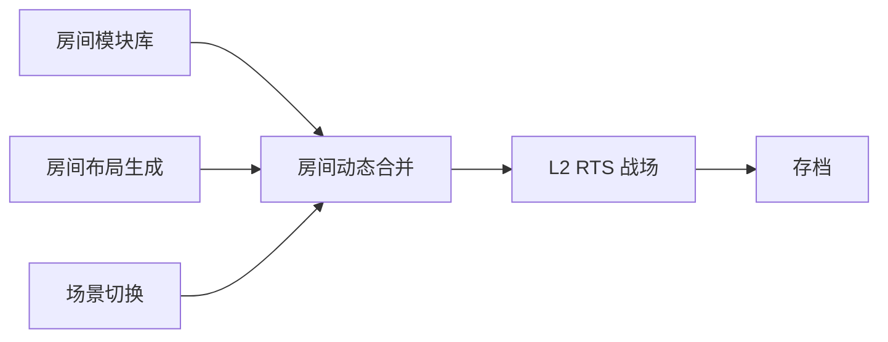
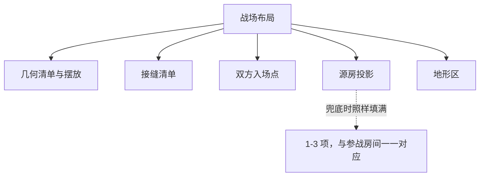

# 文档里的图

Harness 所有文档的画图约定 —— GDD、ADR、便条、sprint plan、阶段报告，一视同仁。
**关系用 mermaid，空间用 ```svg 图解。两种都只写名字、不写颜色。**

---

## 什么时候该画

**判据：一段话要读者在脑子里同时记住三样以上东西之间的关系时，画出来。**

| | 例 |
|---|---|
| ✅ 该画 | 「三种拼接失败都走兜底，而五种真错误根本不产生战场」—— 两组东西、两条去向 |
| ✅ 该画 | 「分发器问本系统选房 → 切换层组装 → 再调本系统拼装 → 交给战场层」—— 四方、两次往返 |
| ❌ 不该画 | 「容差是半格」—— 一句话说完的事 |
| ❌ 不该画 | 把一段已经很清楚的文字再用方框重画一遍 |

**图要替掉那段话，不是给那段话配插图。** 画完之后如果原文一个字都没减，
说明这张图没在干活。

---

## 记法

### 默认：mermaid

写在 ` ```mermaid ` 围栏里。GitHub、Notion、VS Code 预览、Claude 的 artifact
都直接渲染它；不渲染的地方退化成一段能读的文字，不会变成乱码。

> **客户端现状（2026-09-14）**：XGameHarnessUI **1.0.13 之后的下一个包**起，
> ` ```mermaid ` 和 ` ```svg ` 都画成图（深浅两档都对）。
> 装着 1.0.13 及更早的，这两种围栏显示成代码块 —— 文档照写，更新客户端就好。

### 什么时候不用 mermaid

- **矩阵、对照、参数表** → 用 GFM 表格。mermaid 画不了表，硬画只会更难读
- **空间布局**（房间怎么摆、门在哪、关卡形状、界面长什么样）→ mermaid 画不了自由图形，
  用 **` ```svg ` 图解**（见下面「图解」那一节）
- **已经用 ASCII 画好且读得懂的旧图** → 别为了统一记法去重画。
  改到那一段时顺手换，没改到就留着

### 绝对不能用

**围栏外面的原始 HTML** —— 包括直接写进正文的 `<svg>`、``、`<details>`、
`<span style=…>`。客户端故意不装 `rehype-raw`：文档是不可信输入，而开了原始 HTML
之后，一段 `position:fixed` 就能在界面的按钮上盖一个假的（理由的全文在客户端 D-136）。
写了会被转义成一屏尖括号 —— 不报错，就是没法读。

**` ```svg ` 围栏里的 SVG 不算原始 HTML**：它走的是一条单独过名单的路（D-137），
所以图解只能写在围栏里。

**配套 HTML 页 + 链接**这条原来的退路**别再用了**：客户端里点那个链接，
打开的是系统浏览器里的一个 404（边车只发界面自己的文件）。

---

## 五种骨架，照抄改词

### 一、分支：一件事有几种去向

最常用的一种。分类、失败模式、资格判定都是它。



**要点**：菱形是判断，方框是结果。用 `class 节点 ok/warn/no` 给三类结果上色，
读者扫一眼就知道哪条是好路。`<br/>` 换行，让方框里能写两行。

> ⚠ **别写 `style C fill:#d6e5dc`。** 那是一个浅绿，在客户端深色档下就是
> 浅底浅字，看不清。写死的颜色客户端一律不用，并在图下面提示一句。
> 名字（`ok` `warn` `no` `key` …）由客户端按当前主题上色 —— 见下面「绘图词表」。

### 二、流转：有生命周期的东西

状态机、run 的阶段、招募流程。



**要点**：箭头上写**触发条件**，不是写动作名。`[*]` 是起止。

### 三、时序：谁先谁后、谁调谁

跨系统的调用链，尤其是有来回的。



**要点**：实线 `->>` 是调用，虚线 `-->>` 是返回。
本系统在链条里出现两次这种事，用时序图一眼就看出来，用文字要写三段。

### 四、依赖：谁依赖谁

上下游关系，一张图代替两张表。



**要点**：把**本篇讲的那个系统**用 `class D key` 描出来，
否则读者分不清这张图的主角是谁。

### 五、构成：一个东西由哪些部分组成

ADR 里的架构图、一份数据的字段构成。



**要点**：虚线箭头 `-.文字.->` 挂注解，用来标那些**反直觉**的地方。

---

## 图解：空间布局用 ` ```svg `

**判据：读者要在脑子里「摆」出一个形状时，画图解。**
房间怎么拼、门在哪、谁站在哪、有哪几种朝向、两种接法长什么样 ——
这些是**位置**，mermaid 只会把它们排成一串方框。
**关系**（谁调谁、谁变成谁、有几种去向）仍然用 mermaid。

写法：一个 ` ```svg ` 围栏，里面**一个** `<svg viewBox="…">`，第一个孩子是 `<title>`，
形状上挂**绘图词表**里的名字。**一个颜色都不写** —— 客户端按当前主题上色，
深浅两档都对。

### 骨架一：房间和门

```svg
<svg viewBox="0 0 480 170">
  <title>门与门之间，他是走过去的</title>
  <rect class="box" x="20" y="20" width="120" height="100"/>
  <rect class="box" x="180" y="20" width="120" height="100"/>
  <rect class="box key" x="340" y="20" width="120" height="100"/>
  <rect class="box" x="140" y="58" width="40" height="24"/>
  <rect class="box" x="300" y="58" width="40" height="24"/>
  <line class="gap" x1="140" y1="60" x2="140" y2="80"/>
  <line class="gap" x1="180" y1="60" x2="180" y2="80"/>
  <line class="gap" x1="300" y1="60" x2="300" y2="80"/>
  <line class="gap key" x1="340" y1="60" x2="340" y2="80"/>
  <path class="route" d="M50 70 H 420" marker-end="url(#arrow-key)"/>
  <circle class="dot key" cx="50" cy="70" r="6"/>
  <text class="label" x="80" y="146" text-anchor="middle">小厅</text>
  <text class="label" x="240" y="146" text-anchor="middle">岔路</text>
  <text class="name key" x="400" y="146" text-anchor="middle">撞见敌人的那间</text>
</svg>
```

**要点**：房间是 `box`，本篇的主角加 `key`。门是 `gap` —— **画在墙上**，
把那一截墙线盖掉；开在 `key` 那间墙上的门也挂 `key`（缺口要跟那间的底色一样）。
走廊就是一个窄的 `box`。路线用 `route`，箭头用词表里的 `#arrow-key`。
**路线穿过哪面墙，那面墙上就得有门** —— 不然画的是穿墙。

### 骨架二：左右对照（好的一边 / 坏的一边）

```svg
<svg viewBox="0 0 480 130">
  <title>有战场，和没有战场，是两件事</title>
  <rect class="zone ok" x="10" y="10" width="210" height="70"/>
  <circle class="dot" cx="50" cy="45" r="6"/>
  <circle class="dot no" cx="180" cy="45" r="6"/>
  <text class="name ok" x="115" y="110" text-anchor="middle">拼不起来 · 照样有战场</text>
  <rect class="line no dashed thick" x="260" y="10" width="210" height="70"/>
  <line class="line no thick" x1="345" y1="28" x2="385" y2="62"/>
  <line class="line no thick" x1="385" y1="28" x2="345" y2="62"/>
  <text class="name no" x="365" y="110" text-anchor="middle">真出事了 · 没有战场</text>
</svg>
```

**要点**：两边**画进同一张图**（markdown 里没有左右两栏）。好的一边 `ok`、坏的一边 `no`；
「什么都没有」画成一个只有轮廓的框（`line` 挂在 `<rect>` 上就是只描边不填色）。

### 骨架三：并排的几个小图

```svg
<svg viewBox="0 0 400 110">
  <title>没有别的角度，只有这四种</title>
  <defs><rect id="room" class="box" x="10" y="10" width="60" height="60"/></defs>
  <g transform="translate(0,0)"><use href="#room"/><path class="line key thick" d="M20 60 L20 20 L60 20"/><text class="name" x="40" y="98" text-anchor="middle">不转</text></g>
  <g transform="translate(100,0)"><use href="#room"/><path class="line key thick" d="M20 20 L60 20 L60 60"/><text class="name" x="40" y="98" text-anchor="middle">右转</text></g>
  <g transform="translate(200,0)"><use href="#room"/><path class="line key thick" d="M60 20 L60 60 L20 60"/><text class="name" x="40" y="98" text-anchor="middle">掉头</text></g>
  <g transform="translate(300,0)"><use href="#room"/><path class="line key thick" d="M60 60 L20 60 L20 20"/><text class="name" x="40" y="98" text-anchor="middle">左转</text></g>
</svg>
```

**要点**：一样的东西在 `<defs>` 里画一次，用 `<use href="#id">` 摆几次。
**`<use>` 只能引本图里的 `#id`**，指向外面的地址会被拿掉。

### 绘图词表

**形状**（每个图形元素挂一个）：

| 名字 | 画的是 | 挂在 |
|---|---|---|
| `box` | 一块东西：房间、模块、状态 | `<rect>` `<circle>` `<polygon>` |
| `zone` | 一片区域：几块东西合起来的范围，淡底虚线 | `<rect>` |
| `line` | 连线、墙、边界；挂在 `<rect>` 上就是只描边的框 | `<line>` `<path>` `<rect>` |
| `gap` | 墙上的缺口（门、开口）：画在块的边上，把那一截线盖掉 | `<line>` |
| `route` | 一条路线：谁从哪走到哪，虚线圆头 | `<path>` `<line>` |
| `dot` | 一个点：人、入口、原点 | `<circle>` |
| `name` | 字：主要的名字，深一档、加粗 | `<text>` |
| `label` | 字：次要的说明，淡一档 | `<text>` |

**语气**（叠在形状上：`class="box ok"`）—— **跟客户端界面上同名的颜色是同一个意思**：

| 名字 | 说的是 |
|---|---|
| `key` | 本篇的主角 / 重点 / 你在这 |
| `ok` | 成立 / 好的那条路 / 能打 |
| `no` | 不成立 / 出事 / 被拒 |
| `warn` | 兜底 / 要小心 / 有代价 |

**分类**（不带意思，只是「这几样是不同的几类」）：

| 名字 | 说的是 |
|---|---|
| `c1` `c2` `c3` `c4` `c5` `c6` | 第一类 … 第六类。**别拿它们表达好坏** —— 好坏用上面的语气 |

**修饰**：

| 名字 | 效果 |
|---|---|
| `ghost` | 不存在 / 可能有 / 已移除 —— 只剩虚线轮廓 |
| `dashed` | 虚线 |
| `thick` | 粗一档 |

**箭头**：`marker-end="url(#arrow)"`；带语气的是 `#arrow-key` `#arrow-ok` `#arrow-no` `#arrow-warn`。
客户端会自动放进每张图，**不用自己画 `<marker>`**，也**别自己再起这几个 id**。

**mermaid 也用这张表**：`class 节点 ok`（语气、分类、`ghost` 都能用）。

> 这张表**在客户端里有一份一模一样的**（`app/src/lib/drawing.ts`），
> 客户端的测试逐个比两边的名字。**加名字要两边一起加**，否则写了也是灰的。

### 图解的规矩

1. **一个颜色都不写。** `fill="#…"`、`stroke="red"`、`fill="var(--…)"`、`<style>`、`style="…"`
   客户端全部拿掉，并在图下面提示「N 处写死的颜色没用上」。
   唯一能写的是 `fill="none"`。**要颜色就挂词表里的名字。**
2. **按最终尺寸画**：`viewBox` 宽 400～560，字号用词表默认的（不写 `font-size`）。
   客户端铺满列宽，但最多放大 1.5 倍 —— 画成两百宽的话字会偏大、线会偏粗。
3. **字要落在空白处。** 标签压在墙线或别的块上会糊成一团 —— 客户端不会替你挪。
   画完数一遍：每段字底下是不是空的。
4. **`<title>` 必写。** 它是图注（显示在图下面），也是读屏念的名字。
5. **不能用**：`<script>` `<foreignObject>` `<image>` `<animate>` `<set>` `<!DOCTYPE>`
   —— 有一个整张不画；`<a>` 会被换成普通的组（链接不留）。
6. **图里不许写数值**，跟正文一个标准。写「按撞见敌人的那间算位置」，不写「(6000, 0)」。
7. **一张图只说一件事。** 一张图里又摆房间又画流程，拆成一张图解 + 一张 mermaid。

---

## 三条硬规矩

**一、图里不许写数值。** 跟正文一个标准。
写「随关卡推进变少」，不写「× 0.6」。
同一个数在图和规则表各写一遍，改了其中一处不会有任何地方报错。

**二、中文节点名不要带英文标识符。** 写「房间模块库」不写 `URoomModuleSubsystem`。
真名留给「名词对照」那张表。ADR 是例外 —— 它本来就是讲实现的。

**三、一张图只说一件事。** 一张图里塞了判断、时序、依赖三种关系，
等于三张图叠在一起，读者一样得在脑子里拆开。拆成三张。

---

## 语法坑（都踩过）

| 症状 | 原因 | 怎么写 |
|---|---|---|
| 图下面说「写死的颜色没用上」 | 写了 `style X fill:#…` / `classDef` 里写色值 | `class X ok`（名字见绘图词表） |
| 整张图不渲染 | 节点文字里有 `(` `)` `[` `]` `{` `}` | 用引号包起来：`A["含(括号)的文字"]` |
| 中文节点名报错 | 文字里有 `:` `;` | 同上，用引号包 |
| 箭头文字丢了 | `-->|文字|` 写成了 `--> |文字|` | 竖线**紧贴**箭头，不留空格 |
| 换行不生效 | 用了 `\n` | 用 `<br/>` |
| 方向不对 | `TD` / `LR` 写混 | `TD` 上到下（分支用），`LR` 左到右（依赖、流程用） |

---

## 各类文档画什么

| 文档 | 最该画的 |
|---|---|
| **GDD 读本** | 分支（失败去向）、时序（谁调谁）、**图解**（空间：房间怎么摆、门在哪） |
| **GDD 正文** | 流转（状态机）、依赖（上下游） |
| **ADR** | 构成（架构）、依赖。**ADR 允许出现真实类名与接口名** |
| **便条** | 通常不需要。一件事说不清才画，且只画一张 |
| **sprint plan** | 依赖（任务先后）。甘特图慎用 —— 它很快就过期 |
| **阶段报告** | 分支（判定结论怎么来的） |
