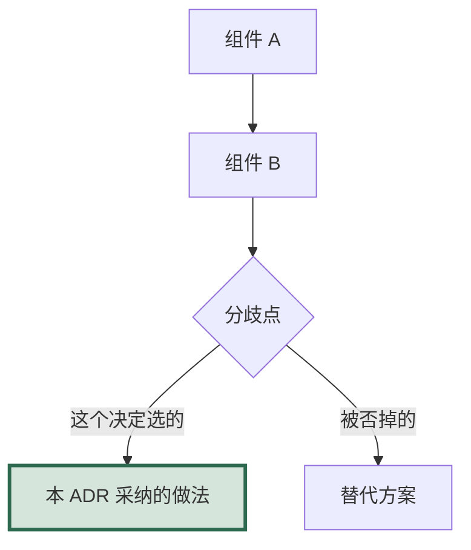

# ADR-[NNNN]: [Title]

## Status

[Proposed | Accepted | Deprecated | Superseded by ADR-XXXX]

## Date

[YYYY-MM-DD]

## Decision Makers

[Who was involved in this decision]

## Context

### Problem Statement

[What problem are we solving? Why must this decision be made now? What is the
cost of not deciding?]

### Current State

[How does the system work today? What is wrong with the current approach?]

### Constraints

- [Technical constraints -- engine limitations, platform requirements]
- [Timeline constraints -- deadline pressures, dependencies]
- [Resource constraints -- team size, expertise available]
- [Compatibility requirements -- must work with existing systems]

### Requirements

- [Functional requirement 1]
- [Functional requirement 2]
- [Performance requirement -- specific, measurable]
- [Scalability requirement]

## Decision

[The specific technical decision, described in enough detail for someone to
implement it without further clarification.]

### Architecture

画成 mermaid，不要用 ASCII。骨架见 `docs/diagrams.md` 的「五、构成」与「四、依赖」。
**ADR 是唯一允许在图里写真实类名与接口名的文档** —— 它本来就是讲实现的。



把**这个决定本身**在图里描出来（上面 `style` 那行），
否则读者看不出这张架构图里哪一块是本篇拍的板、哪一块是既有的。

### Key Interfaces

```
[Pseudocode or language-specific interface definitions that this decision
creates. These become the contracts that implementers must respect.]
```

### Implementation Guidelines

[Specific guidance for the programmer implementing this decision.]

## Alternatives Considered

### Alternative 1: [Name]

- **Description**: [How this approach would work]
- **Pros**: [What is good about this approach]
- **Cons**: [What is bad about this approach]
- **Estimated Effort**: [Relative effort compared to chosen approach]
- **Rejection Reason**: [Why this was not chosen]

### Alternative 2: [Name]

[Same structure as above]

## Consequences

### Positive

- [Good outcomes of this decision]

### Negative

- [Trade-offs and costs we are accepting]

### Neutral

- [Changes that are neither good nor bad, just different]

## Risks

| Risk | Probability | Impact | Mitigation |
|------|------------|--------|-----------|

## Performance Implications

| Metric | Before | Expected After | Budget |
|--------|--------|---------------|--------|
| CPU (frame time) | [X]ms | [Y]ms | [Z]ms |
| Memory | [X]MB | [Y]MB | [Z]MB |
| Load Time | [X]s | [Y]s | [Z]s |
| Network (if applicable) | [X]KB/s | [Y]KB/s | [Z]KB/s |

## Migration Plan

[If this changes existing systems, the step-by-step plan to migrate.]

1. [Step 1 -- what changes, what breaks, how to verify]
2. [Step 2]
3. [Step 3]

**Rollback plan**: [How to revert if this decision proves wrong]

## Validation Criteria

[How we will know this decision was correct after implementation.]

- [ ] [Measurable criterion 1]
- [ ] [Measurable criterion 2]
- [ ] [Performance criterion]

## Related

- [Link to related ADRs]
- [Link to related design documents]
- [Link to relevant code files]
