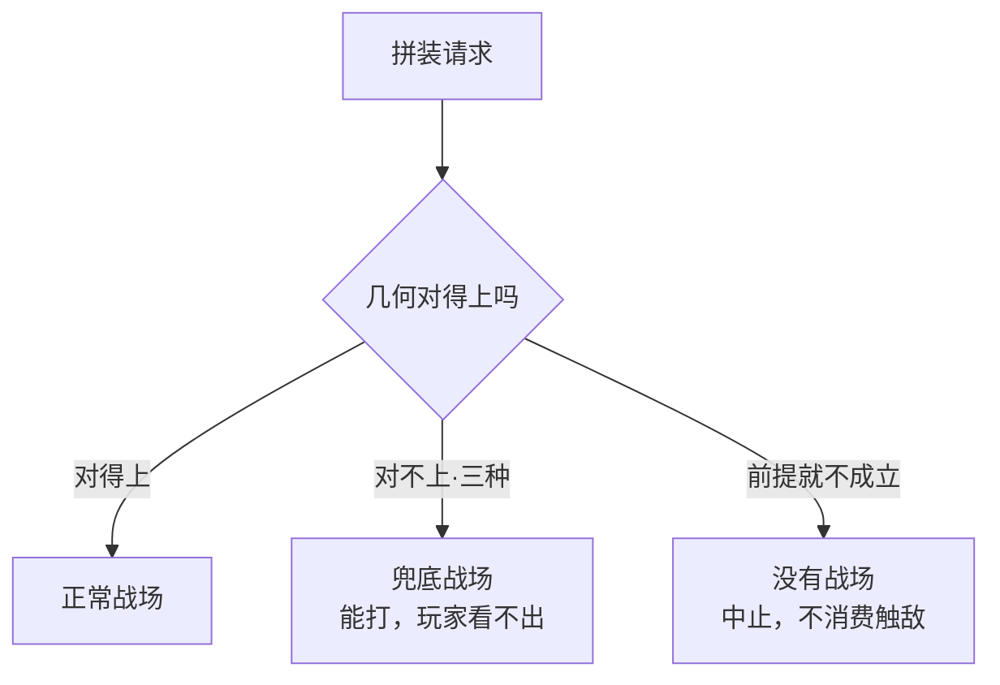

# Design Document Rules

## Scope of these rules

These rules govern **per-system design documents** — the output of `/design-system`
and `/reverse-document design`. Other documents that live under `design/gdd/`
(game-concept, game-pillars, systems-index, economy model, faction and character
sheets, art/sound bible) have their own templates and are NOT graded or checked
against the section lists below.

## Rigor first

- Every per-system design document MUST declare a rigor level in its header:
  `Rigor: Lite` or `Rigor: Full`
- **Lite is the default.** Escalate to Full only when the change hits one of these:
  touches more than 2 existing systems' interfaces; changes the core loop; involves
  the economy or monetization; affects save compatibility; involves network
  replication; or is a brand-new system that has never been designed before
  (being enumerated in `systems-index.md` does not make it designed)
- A Full document MUST state which trigger justified the escalation
- Grading exists so small changes still get written down. Do NOT apply the Full
  checklist to a Lite document — that is not a finding, it is the point

## Every document, both rigor levels

- MUST open with four sections, before any tier-specific content:
  - `## 读本` — **一份完整的、能从头读到尾的策划案**，不是导语、不是摘要。
    详见下面「读本怎么写」那一节。
  - `## 设计前提` — the plain-language premise the user confirmed before writing
    started, unedited. A one-line system description in `systems-index.md` is NOT
    an approved premise; approving an index approves the enumeration, not what
    those words expand into
  - `## 已定决策摘要` — upstream constraints with their source files, and for each,
    whether it is normative or an illustrative data example (downstream treats
    examples as hard dependencies unless told otherwise). A delegation brief dies
    with the task; the file is what the next reader has
  - `## 本篇用到的新词` — every term this document coins that the user has not used
    before, with meaning and why an existing word would not do. Write 无 if there
    are none; never leave it empty
- **A term the user has not met MUST NOT appear in a question put to them.**
  Restate decisions in vocabulary the user has already used, or introduce the term
  first. A well-formed Open Questions section makes a handoff look complete;
  format compliance is not comprehension
- A design document is a **behavior contract, not an implementation plan**.
  Test: if the implementation can change without changing player-observable
  behavior, it does not belong here
- MUST NOT contain: concrete class/function names, Blueprint node wiring, library or
  framework selection (those go in an ADR), per-item number tables (those go in data
  files), or step-by-step implementation plans (those go in the sprint plan)
- Acceptance criteria must be testable — a QA tester must be able to verify pass/fail
- No hand-waving: "the system should feel good" is not a valid specification.
  Feel and pacing are validated by playtest, not asserted in a design document
- MUST be written incrementally: create the skeleton first, then fill each section one
  at a time with user approval between sections. Write each approved section to the
  file immediately to persist decisions and manage context

## 读本怎么写

**读本是一份完整的策划案，不是导语，不是摘要。**

用户原话（2026-09-07，第二次说时把第一版否掉了）：

> 我希望读本不只是几句大白话，而且开发者通过客户端能看到的 GDD
> 是完整的可读的一份策划案。

判据只有一条：**一个不做这块的开发者只读读本，应该完全懂这个系统怎么运转。**
读完还得回去翻规则表才明白，就是没写够。

### 读本不是把规则表翻译一遍

**判据那句「只读读本就该完全懂」，只讲了完整性，没讲清另一半：
读的人得在脑子里建起一个能用的模型，不是收到一份等价的信息。**

一份只做翻译的读本，逐条覆盖了规则，读完却还是不知道
「这套东西为什么长这样」「我接它的时候会踩哪儿」。它过得了完整性判据，
却没帮上任何人 —— 而这一点**不会有任何地方报错**。

下面十三节里，第 1-6 节**把系统讲完整**，第 7-13 节**帮人真的懂**。
**后半截不是可选项** —— 缺了它，读本退化成一份白话规则表。

### 十三节（Full 文档）

**一律用三级标题，一律带序号，序号从 1 连排到 13。**
编号规矩见下面「标题怎么写」那一节，那是硬性的。

**开场 —— 三十秒内让人知道这是什么：**

1. **一句话** —— 用一句话说完这个系统干什么、谁调它。**真的只写一句。**
   读者可能只读这一节就走了，那也得让他带走对的东西
2. **打个比方** —— 拿他已经懂的东西类比，**并且说清这个比方在哪儿失效**。
   一个不说边界的比方会把人带沟里，比不打比方更糟
3. **没有它，游戏会缺什么** —— 它在整个游戏里占什么位置

**它是什么 —— 把系统讲完整：**

4. **玩家在里面经历什么** —— 从玩家视角走一遍：他看到什么、做什么决定、
   赢了输了分别是什么感受
5. **它怎么运转** —— **最长的一节，而且必须完整**：每条会影响玩家决策的
   规则都要讲到，只是不写成条目和公式。按「什么时候发生什么」分小节
6. **它明确不做的事** —— 负空间。读者对一个系统的误解，
   一半来自以为它管了它不管的事

**为什么 —— 帮人真的懂：**

7. **为什么这么定** —— 关键取舍，**逐条写**，每条一个四级标题：
   这个决定是什么、**定成另一个样子会怎样**、为什么没那么定。
   写成一段连排的「权衡讨论」等于没写 —— 读者记不住，也无法逐条引用
8. **最容易搞错的 N 件事** —— 这个系统里**反直觉**的点，逐条列。
   判据：一个聪明但没读过这篇的人，会**想当然地以为**是另一个样子的地方。
   **这一节往往是整篇最有价值的部分** —— 它挡住的是真的会发生的误解

**怎么用 —— 读者是要去做事的：**

9. **一个完整的例子** —— 从头到尾走一遍具体的一局 / 一次交互，带上具体情境
10. **名词对照** —— 白话说法 ↔ 文档/代码里的真实名字，一张表。
    见「硬规矩」里对这一节的专门豁免。没有需要对照的词就写「无」
11. **旋钮速查** —— 旋钮叫什么、它控制什么、调大调小分别会怎样，一张表。
    **末尾一句「具体数值见规则表」**。禁数值那条在这里同样有效，
    这张表给的是**方向**不是数字
12. **如果你要跟它对接** —— 按角色分，各自最少需要知道什么。
    「你要改 X，注意 Y」「你要读它的输出，先搞清 Z」。
    **末尾附一小节「还没定、但会影响你的事」** —— 别让人照着未决的东西去做
13. **只记三句话** —— 全篇收口。如果读者只带走三句，该是哪三句

Lite 文档写 **1 / 2 / 5 / 8 / 13** 五节，序号照样从 1 连排到 5
（不要沿用 Full 的原编号，那样会出现跳号）。

### 标题怎么写

读本的标题有两个活儿：**让人想读下去**，以及**让人知道自己读到哪了**。

#### 一、所有标题带序号，一个不许漏

**这条是硬性的，2026-09-14 用户明确要求：**

> 所有读本中的标题前都要加 1234 的序号，方便我定位一共有多少条、读到了多少条。

- 三级标题：`### 1. 一句话`、`### 5. 它怎么运转`
- 四级标题：**跟父节号**，`#### 5.1 战斗触发的那一瞬间`、`#### 7.3 走廊是一块几何`
- **连号，从 1 开始，不许跳号、不许重号。** 删掉一节就把后面的重排
- 便条同理：便条不分节时不编号；一旦用了标题，就从 1 连排

**为什么要编号**：客户端的目录认到四级。没有编号时，读者在左边目录里
看到的是一串长短不一的标题，**既数不出总共几条，也认不出自己读到了第几条**。
有了编号，目录变成进度条。

#### 二、标题要短，而且自己会说话

对照一下同一篇文档的两种写法：

| 写法 | 例 |
|---|---|
| ❌ 长、只报类目 | `这是个什么系统` / `玩家在里面经历什么` / `如果你要跟它对接` |
| ✅ 短、带结论或钩子 | `一句话` / `打个比方` / `名词对照` / `旋钮速查` / `只记三句话` |

上面十三节的固定标题已经按这个原则定好了，**照抄即可，不要自己扩写**。

需要你自己起标题的是**四级小节**，那里守两条：

- **能带结论就带结论**，别只报类目。
  ❌ `失败处理` → ✅ `对不上就整场换图，绝不挪一厘米`
- **父标题里写上数目**。`最容易搞错的七件事`、`七个关键决定` ——
  读者一眼知道这一节有多少条、还剩几条。
  数目写进标题之后，**子项数量必须真的对得上**

### 三条硬规矩

**正文里不许出现**：系统编号（`#20 §R7`）、类名 / 函数名、文件路径、
缩写代号（`PP-D5`、`FP gate`）、本篇之外没解释过的术语。

> **例外：`名词对照` 那一节就是用来放这些的。**
>
> 这条豁免是 2026-09-14 加的，起因是三个工具写同一篇读本做对照，
> 用户挑出「有术语速查」是好读的关键，而当时的规矩把它禁掉了。
>
> **根子是读者模型错了。** 规矩原本假设「不做这块 = 不碰代码」，
> 于是把标识符清得干干净净。但真实读者是**要跟这个系统对接的开发者** ——
> 他读完读本回到代码里，看见那个真名却对不上号，这篇读本对他就白写了。
>
> 分界线：**正文用白话，对照表给真名。** 正文里写「战场坐标系」，
> 对照表里写「战场坐标系 = 代码/文档里的那个真名」。
> 正文一旦开始直接用真名，这条豁免就被滥用了。

**不许写具体数值和公式。** 说「买通一个 AI 的价钱随着关卡推进变少」，
不说「叛价 = 合作余利 × 0.6」。

> 这一条是**防走散**用的，不是嫌数字难读。读本和下面的规则表讲的是同一个
> 系统 —— 同一个数在两处各写一遍，改了其中一处**不会有任何地方报错**，
> 而下游会照着过期的那份做下去。**数值只有规则表那一份**，
> 读本负责说清它是什么、往哪个方向变。
>
> ⚠ **这条没有豁免，`名词对照` 也不行。** 想做一张「数字速查」的冲动是对的
> —— 读者确实需要快速扫一眼 —— 但**抄一份数值过来是这份规则里最贵的错**。
> 要这个效果就写成**旋钮速查**：旋钮叫什么、它控制什么、调大调小分别会怎样，
> 末尾一句「具体数值见规则表」。有速查的好处，没有两处走散的风险。

**不许省。** 「详见下文」「具体规则见 Detailed Rules」这类句子在读本里是
失败信号 —— 读本的读者正是那个不会往下翻的人。

> 唯一的例外就是上面那句「具体数值见规则表」—— 那不是省略，
> 是**明确指出唯一真值在哪儿**。

### 排版：读本是拿来读的，不是拿来查的

**读本现在最常见的失败不是写少了，是写成一堵墙。**

第一篇写出来的读本（`layer-1-room-exploration`），`它怎么运转` 那一段是
**十五个连着排的长段落**，通篇只有一处用了列表 —— 而那一处恰好是全篇最好读的
地方。用户 2026-09-08 的原话：「条理还是不够清晰，读本排版还是不够方便阅读。」

**写全了但读不动，跟没写全的结果是一样的** —— 判据那句「只读读本就该完全懂
这个系统怎么运转」，前提是他真的读得下去。

下面三条只管**长什么样**，上面那十三节写什么一个字都不改。

> ⚠ **这三条管整篇，不是只管 `它怎么运转`。**
>
> 这条边界是 2026-09-14 划清的。在那之前规矩只写在「它怎么运转」名下，
> 结果是：那一节确实分好了小节，而 `为什么这么定` 和 `一个完整的例子`
> 照样是连排长段 —— 规矩执行了，读本照样被判为一堵墙。
>
> **一节被漏掉，整篇就还是读不动。**

#### 一、任何一节长过十来段就分小节

用**四级标题**，按**玩家在做什么**分，不按实现模块分。

- 好的分法：走路和看路 / 房间里有什么 / 碰上敌人 / 跟东西打交道 /
  界面打开的时候 / 出岔子的时候
- 坏的分法：状态机 / 数据流 / 事件系统 —— 那是按代码分的，
  而读本的读者不看代码

客户端读 GDD 时**目录认到四级**，所以这些小节在屏幕左边是点得到的。
分了小节，读的人才跳得到「小地图那一段」；不分，他只能从头滚。

#### 二、并列的几种情况写成列表

> ⚠ **上面那句「不写成条目和公式」说的是不许把规则表抄过来，不是不许用列表。**
>
> 第一篇读本把它读成了后者：「七种能互动的东西」和「三种敌人行为」都被压成了
> 长段落。前者后来改成列表，成了全篇最好读的一段；后者到 2026-09-08
> 还埋在段落里。
>
> **这条误读不会有任何地方报错** —— 读本照样写得完整、照样过判据，
> 只是没人读得下去。所以在这儿把分界写死。

判据（**满足任意一条**就该是列表，不必都满足）：

- **同一个句式重复三次以上** ——「宝箱怎样、商人怎样、帐篷怎样」
- **你在句子里数数** ——「有三种失败」「分四步」「两种接法」。
  只要正文写了个数目，那几项就该看得见，不该埋在段落里
- **几项之间是并列关系，读者需要逐项比对** —— 哪怕句式各不相同

反例（这些**不是**列表，是一段话）：「因为 A 所以 B，于是 C」这类因果链。

> ⚠ **判据是 2026-09-14 放宽的。** 原来只有第一条「句式重复三次」，
> 太严：「三套坐标」「四种状态」「输出分四组」这些内容句式并不重复，
> 照旧判据都不该做成列表 —— 而它们恰恰是读者最需要扫着看的地方。

列表里仍然不许出现数值和公式 —— 那条规矩管的是**内容**，跟排版无关。

#### 三、一段一件事，头一句就说完这件事

每段**开头一句加粗**，把这一段的结论说完；剩下的展开它。
扫一遍加粗那几句就该知道这一节讲了什么，要细节再回去读整段。

段落长过五六行就该拆。**拆不动，说明它其实是两件事。**

#### 四、该画就画 —— 但只有两种画法能用

**判据：一段话要读者在脑子里同时记住三样以上东西之间的关系时，把它画出来。**

- ✅ 该画：「三种拼接失败都走兜底，而五种真错误根本不产生战场」
  —— 两组东西、两条去向，读者得同时拎住
- ❌ 不该画：「容差是半格」—— 一句话说完的事，画出来是装饰

**默认记法是 mermaid**（写在 ` ```mermaid ` 围栏里）。
骨架、语法坑和完整规矩在 `docs/diagrams.md` —— 那是 harness 的单一出处，
GDD / ADR / 便条共用。这里只说读本相关的三条。

**读本里最常用的是「分支」**：一件事有几种去向。



**矩阵、对照、参数表用 GFM 表格**，不要用 mermaid 硬画。

**内联 `<svg>` 和任何原始 HTML 绝对不能用** —— 客户端故意不装 `rehype-raw`
（agent 的输出属于不可信输入），写了会被转义成一屏尖括号，不报错，就是没法读。

**图里照样不许写数值**，跟正文一个标准 —— 那条规矩管内容，跟画不画无关。

**空间布局 mermaid 画不了**（房间怎么摆、界面长什么样）。
值得画好的话做一个配套 HTML 图解页，读本里一行链接指过去。

### 它跟别的几节的关系

| 这一节 | 是什么 | 谁说的 |
|---|---|---|
| `## 读本` | **完整的策划案**，白话，不带数值 | 我们写给读者的 |
| `## 设计前提` | **出处** —— 用户当初确认的原话，一个字不许编辑 | 用户说的 |
| Detailed Rules / Formulas / … | **契约** —— 精确、可判定、带数值 | 给实现和 QA 的 |

读本和契约**不是两份文档，是同一件事的两层**。分界线是：
**读本说「发生什么、为什么」，契约说「精确到什么程度」。**

### 一份都还没有

这条规则 2026-09-07 才立，**现存文档一篇都没有读本**。它们要等下次修订、
或者专门跑一次 `/reverse-document` 才补得上。

客户端在没有这一节时**明说这一篇还没有读本**，不假装
（做不到的事不要长得像做得到）。

## Lite documents

- MUST contain: 意图 (why), 改动 (only what changes — 新增 / 修改 / 移除),
  非目标 (explicitly out of scope), 验收 (3-5 testable conditions)
- 非目标 MUST NOT be empty — it is the scope-creep brake
- 改动 describes the delta, not the whole system. Restating the entire system is the
  signal that this should have been Full
- **A brand-new system downgraded to Lite renames 改动 to 构成** and drops the
  新增/修改/移除 sub-headings — for a system that does not exist yet, two of the
  three are empty by construction. Trigger #6 exists to prevent this shape; when it
  is waived, swap the structure rather than letting each document improvise
- Keep it short. Past roughly 50 lines, restructure as Full

## Full documents

- MUST contain these 6 sections: Detailed Rules, Formulas, Edge Cases,
  Dependencies, Tuning Knobs, Acceptance Criteria
- **`Overview` 和 `Player Fantasy` 并进 `## 读本` 了**（2026-09-07）。
  读本的第 1 段和第 2 段说的正是这两件事 —— 留着的话同一个系统会被写两遍，
  而**两处说法走散时不会有任何地方报错**，正是这份规则刚在
  「不许写具体数值」那条里警告的东西。
  这六节是**契约**：精确、可判定、带数值
- Formulas must include variable definitions, expected value ranges, and example
  calculations — but the formula *shape* and safe ranges only; the concrete values
  live in data files
- Edge cases must explicitly state what happens, not just "handle gracefully"
- Dependencies must be bidirectional — if system A depends on B, B's doc must mention A
- Tuning knobs must specify safe ranges and what gameplay aspect they affect
- Balance values must link to their source formula or rationale
